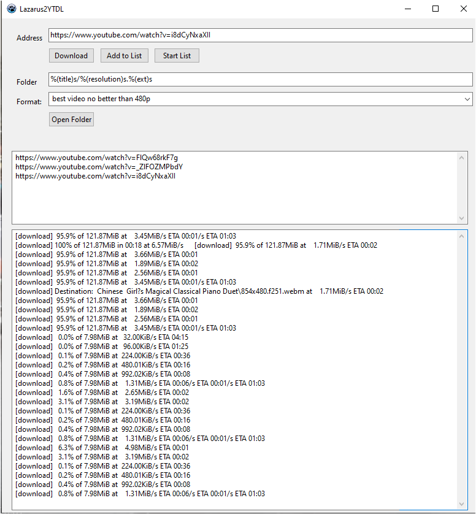

# Lazarus2YTDL
a minimalistic GUI to the yt-dlp commandline tool.

Usage:
1. Paste a download address into the first Edit component.

2. Define a template for the filename in the second Edit
   component. If you have never done so, you should read
   the Readme of yt-dlp first. Start here:
       https://github.com/yt-dlp/yt-dlp#output-template
   You may define either relative paths to the install position
   of this tool, or, absolute paths. Your choice.
   The last template used is restored after restart. Therefore,
   write permission is required for the install dir.

3. Start download using the Button. All messages from
   yt-dlp should appear in the Memo component.

Installation:
- copy all binaries into one folder and create a shortcut for
  this GUI. Thats it. At least yt-dlp.exe and this GUI.
  ffmpeg and ffplay are both optional.
- the install dir needs write permissions.
  
NOTE: the binaries from ffmpeg, ffplay, yt-dlp have their own
      copyrights. You may want to choose the very latest version
      you can find. yt-dlp has it own commandline update.

      Latest yt-dlp release files:
      https://github.com/yt-dlp/yt-dlp#release-files
